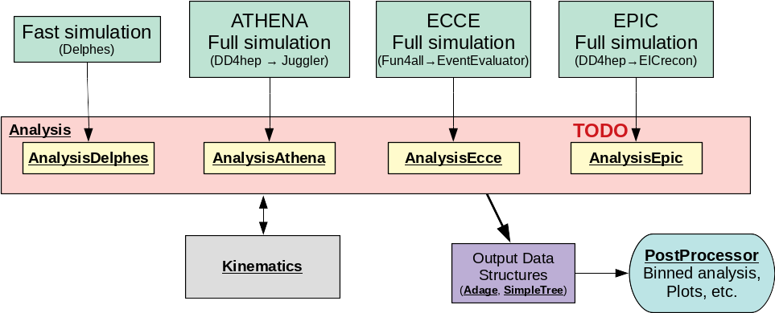

# EPIC-ANALYSIS

General purpose analysis software for (SI)DIS at the EIC

This repository provides a set of common tools for the analysis of both full and
fast simulations, including the following features:

- General event loops for reading upstream data structures; for example,
  `src/AnalysisDelphes.cxx` for reading Delphes trees
- Kinematics reconstruction methods (e.g., leptonic, hadronic, Jacquet-Blondel,
  etc.)
  - see [Kinematics Documentation](doc/kinematics.md) for more information
  - see [Jet Kinematics Documentation](doc/kinematicsJets.md) for jet kinematics
- Calculations of SIDIS variables, such as `PhiH` and `qT`, for single
  particles, as well as jet variables
- Automation for downloading or streaming simulation data from S3, along with
  the capability to combine data from varying Q2 ranges using weights
- Ability to specify arbitrary multi-dimensional binning schemes and cuts
  using [Adage](https://github.com/c-dilks/adage)
- Output data structures include multi-dimensionally binned histogram sets,
  tables, and `TTrees`
- An analysis is primarily driven by macros, used to set up the binning and
  other settings

If you prefer to use your own analysis code, but would still like to make use of
the common tools provided in this repository (e.g., kinematics reconstruction),
this is also possible; you only need to stream the data structure you need, most
likely within the event loop. In this situation, it is recommended you fork the
repository (pull requests are also welcome).

Here is a flowchart showing the main classes (underlined) and the connections to
upstream simulation output:



---


# Setup and Dependencies

## Initial setup
First, clone this `epic-analysis` Github repository:
```bash
git clone git@github.com:eic/epic-analysis.git      # if you have SSH permission
git clone https://github.com/eic/epic-analysis.git  # if you do not have SSH permission
```
This will create the directory `epic-analysis`, which you can then `cd` into.

## Upstream Dependencies
These are common dependencies used for the upstream simulation, some of which
are needed for `epic-analysis` as well.

Follow the [EIC Software Environment Setup Guide](https://eic.github.io/tutorial-setting-up-environment/index.html)
to obtain and install the EIC software image.

- The `eic-shell` script is used to start a container shell
- This image contains all the upstream dependencies needed for EIC simulations
- All documentation below assumes you are running in `eic-shell`

If you upgrade your image (`eic-shell --upgrade`), you may need to `clean` build
everything: `make all-clean && make`

## Local Dependencies
These are additional dependencies needed by `epic-analysis`; they will be built
locally and stored in the `deps/` directory (see [deps/README.md](deps/README.md)
for more details). This section documents how to obtain and build local dependencies:

[Delphes](https://github.com/delphes/delphes) is the only local dependency that
is not mirrored in `deps/`, so you must download and build it first:
```bash
deps/install_delphes.sh
```
- Alternatively, if you already have a `delphes` build elsewhere, symlink `deps/delphes` to it
- All other dependencies in `deps/` are mirrors, and are already included with `epic-analysis`;
  they will be built automatically later

While you are waiting for Delphes to build, you may want to:
- Prepare to analyze some data from S3, following [s3tools documentation](s3tools/README.md)
- Read through the `Kinematics` class [header](src/Kinematics.h) and [source](src/Kinematics.cxx), along
  with [documentation](doc/kinematics.md), to see what physics reconstruction methods are available
- Tutorial macros in the `tutorial/` directory, to learn how to run `epic-analysis`

## Building
First, set environment variables:
```bash
source environ.sh
```
Then compile `analysis-epic` (and some other local dependencies):
```bash
make
```
- We have not yet upgraded to `cmake` in this repository, and still use `Makefiles`
- Build target locations are not yet configurable, and all will stay within `epic-analysis` (e.g.,
  libaries will be installd in `lib/`)
- Additional `make` targets are available (see `Makefile`), for more control during
  development:

```bash
make                     # builds dependencies, then `epic-analysis` (equivalent to `make all`)
make release             # build with optimization enabled
make debug               # build with debugging symbols
make clean               # clean `epic-analysis` (but not dependencies)

make deps                # builds only dependencies
make deps-clean          # clean dependencies
make all-clean           # clean `epic-analysis` and dependencies

make <dependency>        # build a particular `<dependency>`
make <dependency>-clean  # clean a particular `<dependency>`
```

Additional build options are available:
```bash
INCLUDE_CENTAURO=1 make  # build with fastjet plugin Centauro (not included in Delphes by default!)
EXCLUDE_DELPHES=1 make   # build without Delphes support; primarily used to expedite CI workflows
INCLUDE_PODIO=1 make     # build with support for reading data with PODIO
```

## Quick Start: Tutorial Macros
If you're ready to try the software hands-on, follow the [tutorials](tutorial/README.md) in 
the `tutorial/` directory. Otherwise continue reading below.

---


# Simulation

## Delphes Fast Simulation

### Delphes Wrapper
- for convenience, the wrapper script `deps/run_delphes.sh` is provided, which runs
  `delphes` on a given `hepmc` or `hepmc.gz` file, and sets the output file
  names and the appropriate configuration card
  - configuration cards are stored in the `deps/delphes_EIC/` directory,
    a mirror of [`eic/delphes_EIC`](https://github.com/eic/delphes_EIC/tree/master)
  - environment must be set first (`source environ.sh`)
  - run `deps/run_delphes.sh` with no arguments for usage guide
  - in the script, you may need to change `exeDelphes` to the proper
    executable, e.g., `DelphesHepMC2` or `DelphesHepMC3`, depending
    on the format of your generator input
  - if reading a gunzipped file (`*.hepmc.gz`), this script will automatically
    stream it through `gunzip`, so there is no need to decompress beforehand
  - there are some `hepmc` files on S3;  follow [s3tools documentation](s3tools/README.md)
    for scripts and guidance
- the output will be a `TTree` stored in a `root` file
  - output files will be placed in `datarec/`
  - input `hepmc(.gz)` files can be kept in `datagen/`

### AnalysisDelphes
- The class `AnalysisDelphes` contains the event loop for reading Delphes trees
  - There are several classes which derive from the base `Analysis` class;
    `Analysis` handles common setup and final output, whereas the derived
    classes are tuned to read the upstream data formats
- See the event loop in `src/AnalysisDelphes.cxx` for details of how the full
  simulation data are read


## ePIC Full Simulation

- Full simulation files are stored on S3; follow [s3tools documentation](s3tools/README.md)
  for scripts and guidance
- In general, everything that can be done in fast simulation can also be done in
  full simulation; just replace your usage of `AnalysisDelphes` with
  `AnalysisEpic`
  - In practice, implementations may sometimes be a bit out of sync, where some
    features exist in fast simulation do not exist in full simulation, or vice
    versa
- See the event loop in `src/AnalysisEpic.cxx` for details of how the full
  simulation data are read

## ATHENA and ECCE Full Simulations

- Similar implementation as ePIC full simulation, but use `AnalysisEcce` or `AnalysisAthena`

---


# Analysis Procedure

After simulation, this repository separates the analysis procedure into two
stages: (1) the *Analysis* stage includes the event loop, which processes either
fast or full simulation output, kinematics reconstruction, and your specified
binning scheme, while (2) the *Post-processing* stage includes histogram
drawing, comparisons, table printouts, and any feature you would like to add.

The two stages are driven by macros. See examples in the `tutorial` directory,
and follow the [README](tutorial/README.md).

- **Note**: most macros stored in this repository must be executed from the
  `epic-analysis` top directory, not from within their subdirectory, e.g., run
  `root -b -q tutorial/analysis_template.C`; this is because certain library
  and data directory paths are given as relative paths

In general, these macros will run single-threaded. See [HPC documentation](hpc/README.md)
for guidance how to run multi-threaded or on a High Performance Computing (HPC) cluster.

## Analysis Stage

### Analysis Macro and Class

- the `Analysis` class is the main class that performs the analysis; it is 
  controlled at the macro level
  - a typical analysis macro must do the following:
    - instantiate an `Analysis` derived class (e.g., `AnalysisDelphes`)
    - set up bin schemes and bins (arbitrary specification, see below)
    - set any other settings (e.g., a maximum number of events to process,
      useful for quick tests)
    - execute the analysis
  - the input is a config file, which contains a list of files to analyze
    together with settings such as beam energy and Q2 ranges; see
    [doc/example.config](doc/example.config) for an example config file and
    more details
  - the output will be a `root` file, filled with `TObjArray`s of
    histograms
    - each `TObjArray` can be for a different subset of events (bin), e.g.,
      different minimum `y` cuts, so that their histograms can be compared and
      divided; you can open the `root` file in a `TBrowser` to browse the
      histograms
    - the `Histos` class is a container for the histograms, and instances of
      `Histos` will also be streamed to `root` files, along with the binning
      scheme (handled by the Adage `BinSet` class); downstream post processing code
      makes use of these streamed objects, rather than the `TObjArray`s
  - derived classes are specific to upstream data structures:
    - `AnalysisDelphes` for Delphes trees (fast simulations)
    - `AnalysisAthena` for trees from the DD4hep+Juggler stack (ATHENA full simulations)
    - `AnalysisEcce` for trees from the Fun4all+EventEvaluator stack (ECCE full simulations)
  - the `Kinematics` class is used to calculate all kinematics
    - `Analysis`-derived classes have one instance of `Kinematics` for generated
      variables, and another for reconstructed variables, to allow quick
      comparison (e.g., for resolutions)
    - calculations are called by `Analysis`-derived classes, event-by-event or
      particle-by-particle or jet-by-jet
    - see [Kinematics Documentation](doc/kinematics.md) for details of `Kinematics`

### Bin Specification

- The bins may be specified arbitrarily, using the Adage `BinSet` and `CutDef` classes
  - see example `analysis_*C` macros in `tutorial/`
  - `CutDef` can store and apply an arbitrary cut for a single variable, such as:
    - ranges: `a<x<b` or `|x-a|<b`
    - minimum or maximum: `x>a` or `x<a`
    - no cut (useful for "full" bins)
  - The set of bins for a variable is defined by `BinSet`, a set of bins
    - These bins can be defined arbitrarily, with the help of the `CutDef`
      class; you can either:
      - Automatically define a set of bins, e.g., `N` bins between `a` and `b`
        - Equal width in linear scale
        - Equal width in log scale (useful for `x` and `Q2`)
        - Any custom `TAxis`
      - Manually define each bin
        - example: specific bins in `z` and `pT`:
          - `|z-0.3|<0.1` and `|pT-0.2|<0.05`
          - `|z-0.7|<0.1` and `|pT-0.5|<0.05`
        - example: 3 different `y` minima:
          - `y>0.05`
          - `y>0.03`
          - `y>0` (no cut)
          - note that the arbitrary specification permits bins to overlap, e.g.,
            an event with `y=0.1` will appear in all three bins
- Multi-dimensional binning
  - Binning in multi-dimensions is allowed, e.g., 3D binning in `x`,`Q2`,`z`
  - See [Adage documentation](deps/adage/README.md) for more information on how multi-dimensional
    binning is handled, as well as the [Adage syntax reference](deps/adage/doc/syntax.md)
  - Be careful of the curse of dimensionality

### Simple Tree

- The `Analysis` class is also capable of producing a simple `TTree`, handled by the
  `SidisTree` class, which can also be useful for analysis
  - As the name suggests, it is a flat tree with a minimal set of variables,
    specifically needed for SIDIS spin asymmetry analysis
  - The tree branches are configured to be compatible with 
    [asymmetry analysis code](https://github.com/c-dilks/largex-eic-asym)
    built on the [BruFit](https://github.com/dglazier/brufit) framework
  - There is a switch in `Analysis` to enable/disable whether this tree is 
    written


## Post-Processing Stage

### Post-Processing Macro and Class

- results processing is handled by the `PostProcessor` class, which does tasks
  such as printing tables of average values, and drawing ratios of histograms
  - this class is steered by `postprocess_*.C` macros, which includes the
    following:
    - instantiate `PostProcessor`, with the specified `root` file that contains
      output from the analysis macro
    - loops over bins and perform actions, using Adage
- see `src/PostProcessor.h` and `src/PostProcessor.cxx` for available
  post-processing routines; you are welcome to add your own

---


# Contributions

- Add your own analysis scripts (macros, etc.) in `macro/`, either in the main
  directory or in a subdirectory of `macro/`.
  - The `macro/ci` directory is for scripts used by the CI (see `.github/workflows/ci.yml`);
    you are welcome to add new analysis scripts to the CI
  - Make changes in classes such as `PostProcessor` as needed

- Git workflow:
  - Contributions are welcome via pull requests and issues reporting; it is
    recommended to fork this repository or ask to be a contributor
  - Continuous Integration (CI) will trigger on pull requests, which will build
    and test your contribution
    - see `Actions` tab for workflows for details
    - many CI jobs will not work properly from forks (for security), but you
      may ask to be a contributor
  - It is recommended to keep up-to-date with developments by browsing the pull
    requests, issues, and viewing the latest commits by going to the `Insights`
    tab, and clicking `Network` to show the commit graph
